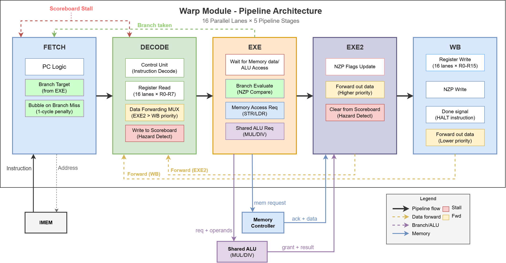
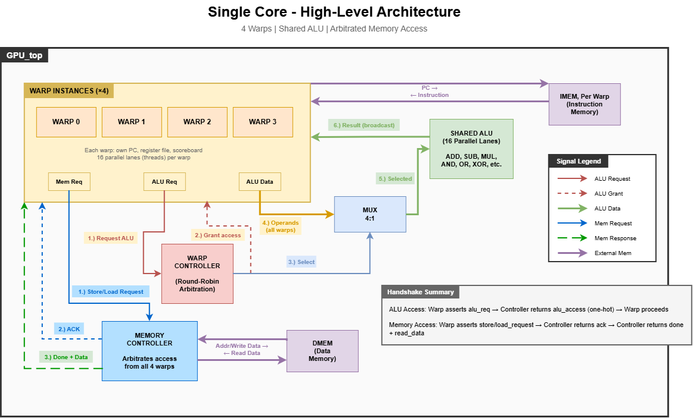
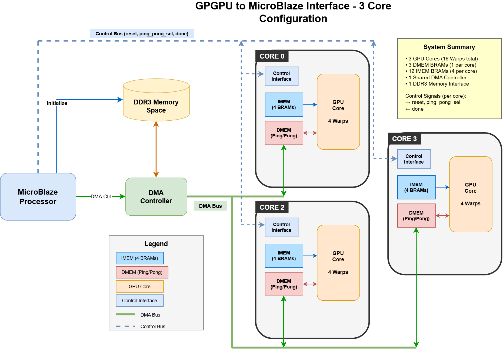
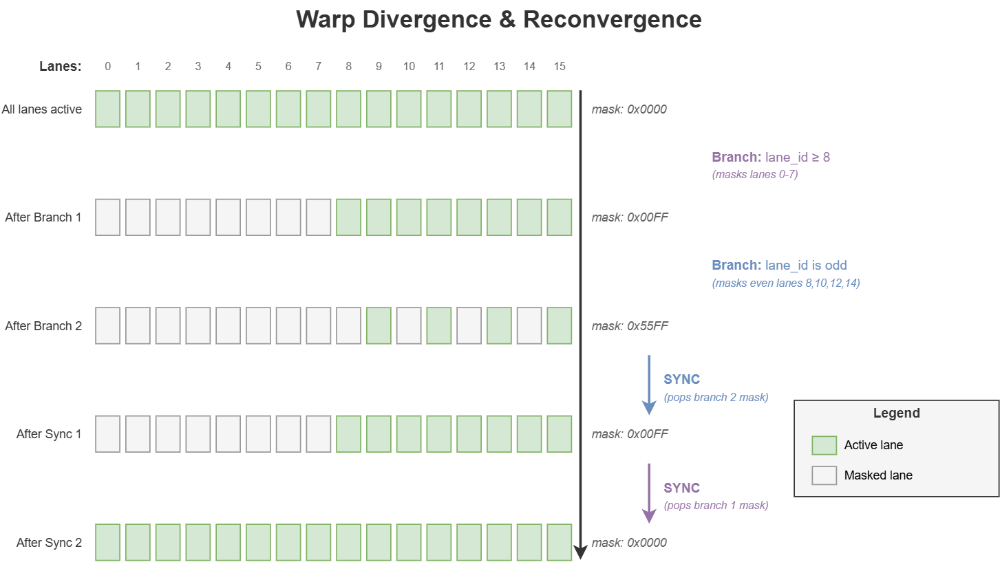

# Smol GPU
An educational custom 3-core parallel processor in SystemVerilog, controlled by MicroBlaze V host and placed on Artix-V board.

## Introduction

The purpose of this project was to further my own understanding of parallel processors and familiarize myself with new tools in FPGA design, such as block diagram to instantiate hard IPs like the MicroBlaze V, DMA Engines, DDR3 Memory, AXI controllers, etc. Additionally to practice the development of firmware to the host controller in charge of writing to the parallel processors data and instruction memory, and controlling when it starts and stops.

For someone trying to learn how a GPU works, I recommend starting with tiny_gpu and smol_gpu, both great resources which inspired my to begin my design on my parallel processor, which grew through many iterations before becoming what it is now. I will omit from a basic introduction to GPU architecture, instead diving into my design in particular, but to the interested person I suggest the two resources mentioned before: tiny_gpu and smol_gpu.

### High Level - Parallel architecture at many levels
There are many layers of parallelization at play in a GPU design, and the terminology between threads, warps, and cores lack universal meaning between companies/architectures, so I will explain how each of these are defined in my design and how each provides a level of parallel abstraction. 

If we were to focus on the "smallest" processing component, we would have a **lane** (or a thread, as some call it). A lane is primarily composed at 16 registers that are, for the most part, unique to it.

A lane, however, has no "autonomy"; 16 lanes are controlled by a single **warp**, with the warp being a traditional SIMT (Single Instruction, Multiple Threads). A warp takes in a single instruction, determines which lanes should be running it, then performs the operation on each of the active lanes at the same time. Lets say for example an instruction goes to the warp telling it multiply Register 4 by Register 5, and place the result in Register 6. The warp will apply this operation to each of its 16 lanes, regardless of their values in each of the three registers. This is the basis of SIMT processing. Below is an example of one of these processors running 16 lanes, the design is heavily inspired by RISC-V 5 stage processor with some custom changes to match the architecture closer.



While each warp acts as a stand-alone processor in most control aspects, there are some resources they have to share, this is due to the fact that four warps coexist in a single core. Most importantly, these warps share a common ALU, meaning all additions, subtractions, multiplcations, etc. need to be scheduled since only one warp has access to it at a time (This is one of the larger differences between my current design and "realer" GPU's who have many different computational resources that are shared such as FPUs, MACs, etc... See section "Future Work" for how this is a goal to implement. In addition to the ALU, all the warps share a memory controller, which stands between the warps and the DMEM bank, scheduling and performing all reads and writes for the warps. The inclusion of the warps allow for maximized usage of the more bottlenecked and/or hardware intensive blocks while allowing each warp to step through their other instructions in parallel, increasing throughput substantially. Below is a simplified representation of how each component interfaces between eachother.



Finally, we take another step backwards; All together, the 4 warps, memory controller, ALU, and warp scheduled make up a single **core**. Each core is directed towards it's own data memory and instruction memory, which in this case is designed as a ping-pong buffer, which will be talked about later. The Artix-V board is capable of containing three unique cores, each with their own address spaces to work out of. The host, a MicroBlaze V processor, can directly control the reset signal of each core and monitor their "done" signals. Additionally, the MicroBlaze V works with a DMA Engine to transfer data memory between their DMEM space and the DDR3 memory, allowing for high speed operational interface. Below we can again see a simplified demonstration of how these three cores are all maintained by the single host and DMA



### ISA
Each instruction is passed into IMEM and given to every warp in the core. In order to focus my time on overall architecture/ Further SoC inegration, I chose a relatively simple 16-bit word, 16 bit instruction set, seen below:

| mnemonic | opcode  | funct3 | funct7    |
|----------|---------|--------|-----------|
| lui      | S110111 |   —    |     —     |
| auipc    | S010111 |   —    |     —     |

TALK ABOUT ADDRESS SPACE for each core *************************

All arithmetic operations are applied to every valid lane within the warp. However, with relatively simple masking applied through the software, operations done on any abitrary number of lanes is easy to accomplish.

## Divergence
Whereas a classic CPU has a straightforward idea of branching, and changing PC depending on conditional tests, a SIMT processor has more complication to it, due to the simple question "what if some lanes meet the condition to branch, but others don't?". There are many unique approaches to this problem, I decided to implement my own slightly modified design involving NZP flags, stacked masks, and conditional branching. 

The CMP, BRnzp, and SYNC instruction carry all the weight of controlling the flow of the warp and divergence. The CMP instruction subtracts one register from another and sets the n - negative, z - zero, and p - postive flag depending on the result, calculated unique for each lane. The BRnzp instruction allows the programmer to determine which flags to look for when deciding when to branch, for example if nzp = '100' in the instruction, then only the lanes with their negative flag set will branch, applying a mask to all other lanes. The destination of the branch is equal to the current PC plus the signed 8-wide immediate passed into the instruction. When a mask is applied to a warp, that particular mask also gets pushed into a LIFO stack. The overall mask applied to the warp will be the "or'ed" result of the entire mask stack, allowing for nested branches. When a SYNC instruction is called, it simply pops the top mask off the stack. Below is an example of nested masks and SYNC call:



Some nuances for this design include the choice to not add the mask stack when an unconditional branch has all lanes taking the branch, typically done by allowing a branch of the n, z, or p flags are set: nzp = '111'. This allows for programmers to jump around their instruction count freely using unconditional branching (essentially, a jump instruction) without fear of overflowing the mask stack. Additionally, a programmer is able to apply a mask without jumping to a new PC at all, by setting the lower 8 bits of the BRnzp instruction to all 0's, the processor never adds to it's PC and steps forward normally, with the new mask applied. 

## Assembly
Currently, the supported assembly is quite simple.
It takes a single input file and line by line compiles it into machine code.

There are two directives supported:
- `.blocks <num_blocks>` - denotes the number of blocks to dispatch to the GPU,
- `.warps <num_blocks>` - denotes the number of warps to execute per each block

Together they form an API similar to that of CUDA:
```cuda
kernel<<<numBlocks, threadsPerBlock>>>(args...)`
```
The key difference being that CUDA allows you to set the number of threads per block while this GPU accepts the number of warps per block as a kernel parameter. 
A compiler developer can still implement the CUDA API using execution masking.

### Syntax
The general syntax looks as follows:
```
<mnemonic> <rd>, <rs1>, <rs2>       ; For R-type
<mnemonic> <rd>, <rs1>, <imm>       ; For I-type
<mnemonic> <rd>, <imm>              ; For U-type
<mnemonic> <rd>, <imm>(<rs1>)       ; For Load/Store
HALT                                ; For HALT
jalr <rd>, <label>                  ; jump to label
jalr <rd>, <imm>(<rs1>)             ; jump to register + offset
```
In order to turn the instruction from vector to scalar you can add the `s.` prefix.
So if you want to execute the scalar version of `addi` you would put `s.addi` as the mnemonic and use scalar registers as `src` and `dest`.

Each of the operands must be separated by a comma.

The comments are single line and the comment char is `#`.

#### Example
An example program might look like this:
```python
.blocks 32
.warps 12

# This is a comment
jalr x0, label              # jump to label
label: addi x5, x1, 1       # x5 := thread_id + 1
sx.slti s1, x5, 5           # s1[thread_id] := x5 < 5 (mask)
sw x5, 0(x1)                # mem[thread_id] := x5 (only non-masked threads exectute this)
halt                        # Stop the execution
```

## Microarchitecture
todo

## Project structure
The project is split into several subdirectories:
- `external` - contains external dependencies (e.g. doctest)
- `src` - contains the system-verilog implementation of the GPU
- `sim` - contains the verilator based simulation environment and the assembler
- `test` - contains test files for the GPU, the assembler and the simulator

## Simulation
The prerequistes for running the simulation are:
- [verilator](https://www.veripool.org/wiki/verilator)
- [cmake](https://cmake.org/)
- A C++ compiler that supports C++23 (e.g. g++-14)

Verilator is a tool that can simulate or compile system-verilog code.
In this project, verilator translates the system-verilog code into C++ which then gets included as a library in the simulator.
Once the prerequistes are installed, you can build and run the simulator executable or the tests.
There are currently two ways to do this:

### Justfile
First, and the more convenient way, is to use the provided [justfile](https://github.com/casey/just).
`Just` is a modern alternative to `make`, which makes it slightly more sane to write build scripts with.
In the case of this project, the justfile is a very thin wrapper around cmake.
The available recipes are as follows:
- `compile` - builds the verilated GPU and the simulator
- `run <input_file.as> [data_file.bin]` - builds and then runs the simulator with the given assembly file
- `test` - runs the tests for the GPU, the assembler and the simulator
- `clean` - removes the build directory

In order to use it, just type `just <recipe>` in one of the subdirectories.

**Note, that the paths you pass as arguments to the `run` recipe are relative to the root of the project.
This is due to the way that the `just` command runner works.**

### CMake
As mentioned, the justfile is only a wrapper around cmake.
In case you want to use it directly, follow these steps:
```bash
mkdir build
cd build
cmake ..
cmake --build . -j$(nproc)
# The executable is build/sim/simulator
# You can also run the tests with the ctest command when in the build directory
```

### Timing problems addressed (make this unique, duh)
The produced exectuable is located at `build/sim/simulator` (or you can just use the justfile).
You can run it in the following way:
```bash
./build/sim/simulator <input_file.as> <data_file.bin>
```
The simulator will first assemble the input file and load the binary data file into the GPU data memory.
The program will fail if the assembly code contained in the input file is ill-formed.

In case it manages to assemble the code, it will then run the simulation and print the first 100 words of the memory to the console.
This is a temporary solution and will be replaced by a more sophisticated output mechanism in the future.

## Acknowledgments
Special thanks go to Adam Majmudar, the creator of [tiny-gpu](https://github.com/adam-maj/tiny-gpu).
As previously mentioned, this project is heavily inspired by it and built on top of it.

The architecture itself is a modified variant of [RISC-V](https://github.com/riscv) RV32I.

Much of the knowledge I've gathered in order to create this project comes from the General-Purpose Graphics Processor Architecture book(2018) by Tor M. Aamodt, Wilson Wai Lun Fung and Timothy G. Rogers,
which I highly recommend for anyone interested in the topic.

## Roadmap
There is still a lot of work to be done around the GPU itself, the simulator and the tooling around it.

- [ ] Add more tests and verify everything works as expected
- [ ] Benchmark (add memory latency benchmarks, etc)
- [ ] Parallelize the GPU pipeline
- [ ] Simulate on GEM5 with Ramulator
- [ ] Run it on an FPGA board

Another step would be to implement a CUDA-like compiler as writing the assembly gets very tedious, especially with manually masking out the threads for branching.
